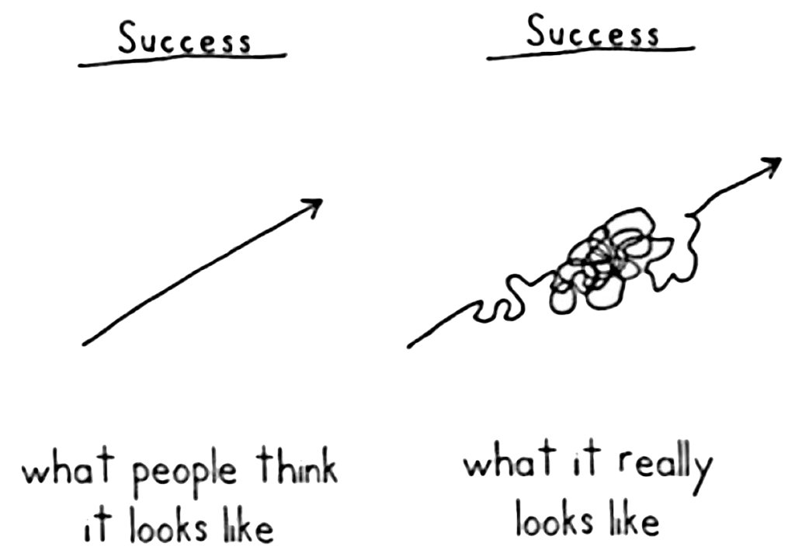

Satchel
===========

Carry around your data


See a project example in action at [satchel_examples](https://github.com/dpastoor/satchel_examples)

## Philosophy

The driving factor behind satchel is helping to solve two issues that become more and more painful as projects get larger: 

1) a project should be split into multiple files to keep knit times manageable and a semblance of organization. This fits nicely with [bookdown](https://github.com/rstudio/bookdown) as a mechanism for organizing Rmd's.

2) Reproducible research should strive to keep code embedded in reports

#### How does `satchel` mitigate these pain points?

First, it allows an easy mechanism for transferring data or objects between Rmd files so that there is only 
a single source of 'truth' for any piece of code (minimize copy and pasting code between files). 
For example, given raw data that needs consistent modifications before use in multiple files, the modifications
should occur once, and the intermediate object be shared to the other files. This allows a single source of the change, 
so any future modifications will be properly propogated to all other instances.

Second, an 'elephant in the room' of literate programming, is the the progression of a project does not proceed in
a straight line, instead more like: 

The total progression should be tracked in the `lab-notebook` to document false leads etc. 
When trying to create a final report though, only specific components will be retained. 
Satchel allows the necessary data/objects/etc to be easily saved from the lab-notebook Rmd files 
into a location that is suitable to be pulled into a separate final-report. 
This further allows the lab-notebook format to be separated from the final reports 
(eg Rmd files in lab-notebook, and Rnw files for final report for more control over layout, references, etc.)

## Using Satchel


### Initialization

Satchel's must be initialized by calling `Satchel$new(...)`

For example:

```{r eval = F}
library(satchel)

satchel <- Satchel$new("<namespace>", "<path/to/satchel/tree>")
```


The resulting object can have any name, though the convention is to use `satchel` 
if only creating one, and `satchel_<additional_identifier>` if using multiple in a single file

```{r eval = F}
other_name <- Satchel$new("<namespace>", "<path/to/satchel/tree>")
```

Multiple satchel nodes can be created in a single file

```{r eval=FALSE}
library(satchel)

satchel_data <- Satchel$new("<namespace>", "<path/to/satchel/tree>")
satchel_plots <- Satchel$new("<other-namespace>", "<path/to/satchel/tree>")
# completely different tree
report_satchel <- Satchel$new("<namespace>", "<finalreport_path/to/satchel/tree>") 
```

This can be useful to save certain objects to pass around between documents in the lab-notebook, 
but separately save out key objects for report(s), presentation(s), etc

### Saving objects

```{r eval = FALSE}
satchel$save(<obj>)
satchel$save(<obj>, data_name = "<other name>")
```

```{r eval=FALSE}
satchel$save(Theoph) # will be saved as Theoph
satchel$save(Theoph, "pk_theoph") # will be saved as pk_theoph
```

The `data_name` is key for use in pipelines, which do not retain the object names being passed

```{r eval = FALSE}
# these will break as the name cannot be deparsed
satchel$save(Theoph %>% mutate(REP = 1)) # would try to save with the literal name `Theoph %>% mutate(REP = 1)
Theoph %>% mutate(REP = 1) %>% satchel$save() # would save with the name `.`

# Instead, specify a name
Theoph %>% mutate(REP = 1) %>% satchel$save("Theoph")
```

At the end of an Rmarkdown file, you can get the information for all saved object during the session

```{r eval=FALSE}
satchel$report()
```

### Using objects from other places

Objects saved from other files can be accessed with `satchel$use(<object_name>, <namespace>)`

Given an data frame called safety_data saved in the safety namespace specified in another file, saved by:

```
satchel <- Satchel$new("safety", "satchel")
...
satchel$save(safety_data)
```

In the new file, the safety_data could be acquired via:

```{r eval=FALSE}
satchel <- Satchel$new("analysis", "satchel")
...
safety_data <- satchel$use("safety_data")
```

Satchel is smart enough to scan all the namespaces for an object called safety_data and pull it in. 
However, if there are multiple safety_data objects saved, an error will occur, and the namespace must
be explicitly set.

For example, in a third file, given:

```
satchel <- Satchel$new("other_safety", "satchel")
...
satchel$save(safety_data)
```

As `safety_data` is present in both `safety` and `other_safety` namespaces, to use it you must specify 
which namespace you want to refer to:

```{r eval=FALSE}
safety_data <- satchel$use("safety_data", "safety")
```

To see what is available across the entire tree, use `satchel$available()` 

### Previewing objects

For ongoing analyses, sometimes it is convenient to get a look at the data you are interested in, without loading
the entire object, especially when dealing with larger datasets. 

`Satchel` automatically keeps a `head()` of certain objects (dataframes, matrices, vectors) so that they can be
previewed, rather than pulling in the entire object.

```{r eval=FALSE}
satchel$preview("safety_data")
```

As this does not need to pull in the entire file, access will be fast and light on memory.

## Patterns

### saving all files in a folder into a satchel

TODO


## Advanced

### access behavior

when 'using' an object, the default behavior is to re-scan the satchel tree to make
sure the object is available and current. This is especially important if using multiple satchel's concurrently, 
when new objects are generated after another is initialized, it may not be aware of those updates. 
This continual scanning may not be ideal if the desire is to load a number of 
objects on after another (for example, pulling in a bunch to a list). To manually control the behavior, 
you can turn off refreshing via `satchel$auto_refresh(FALSE)`

The overall, optimized flow might be something like:

```
satchel$auto_refresh(FALSE) 
satchel$available() # manually query the tree to update it
satchel$use(...)
satchel$use(...)
satchel$use(...)
satchel$use(...)
satchel$auto_refresh(TRUE) # turn auto-refresh back on
```

Keep in mind, this is almost guaranteed to be a unneeded optimization, as scanning the file tree takes microseconds in most cases. However for certain very large projects, or projects with thousands of very small objects saved out, it could play a role.

HINT: if you find yourself saving many small, related objects, it may be better to collapse the objects into a list then just save the single list object.
